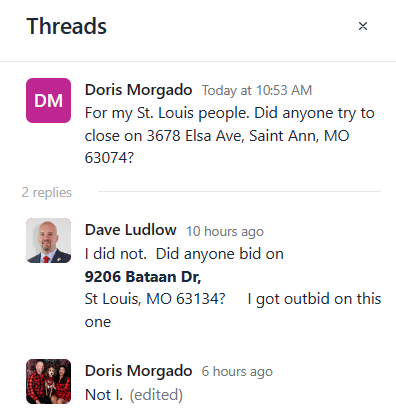

# CardMemberServices

**Description of Purchase**

- Hand Holding for the first 5 properties.

Including finding first 5 "turn-key" section 8 approved properties, finding qualified and reliable management and maintenance contacts to have on retainer, obtaining lending options, finding and accepting qualified section 8 approved tenants, managing and scaling a section 8 real estate business

- One-on-one Breakdown calls
   (Working with you individually to build a strategy that is proven and guaranteed based on your individual circumstance.)

- Access to Private Lenders.

- 3 Group Calls, held on a weekly basis.

Curriculum
  - How to find the Section 8 Properties, MLS / off-market
  - How to obtain financing using government programs
  - How to correctly place tenants  (find / screen)
  - How to buy out of state
  - How to negotiate rents with Section 8 PHA
  - How to find property management / maintenance
  - How to conduct Section 8 inspections
  - Rules / Regulations / loopholes surrounding Section 8 rentals
  - How to delegate all roles surrounding the investment (Inspection, Title Work, Management, Closings)
  - How to make your Section 8 business an autonomous business
  - How to navigate the required paperwork / contracts necessary
  - How to do creative financing and perfect subject 2 financing
  - How to find an optimal market (City & County) for Section 8 rentals
  - How to perform basic calculations to determine profitability of a rental
  - How to access and utilize programs within section 8 for scalability
  - How to leverage other people's money to buy rentals
  - How to structure section 8 partnerships
  - How to find partners within section 8 to invest with you
  - Access to materials (Leases, Operating agreements, Rental Applications… etc)
  - Strategies that can be used to mitigate taxes
  - How to begin Section 8 with every system you possibly need

**Difference between what I purchased and what I recieved**

Once I finally got around to watching a portion of the curriculum, I discovered that the information being sold spins a very positive, yet misleading narrative as to how easy it is to invest-in and become successful with single-family-homes using the Section 8 government program.  The curriculum essentially advocates for the purchasing of super low-end properties (60-80k MAXIMUM price-point) and retrofitting them for low-income section 8 voucher holders to rent out.  

I found that several times in the videos I watched that additional loopholes were mentioned to charge additional for things like $300/mo for a fridge or $100/mo for the microwave, as a means of increasing your rental costs in a way that is technically legal to do, but that ultimately bypasses the 'spirit of the Section 8 program' (Section 8 is essentially a 1974-congress-approved voucher program built on top of the Housing Act of 1937, which states that no American citizen should be forced to pay mor than 30% of their income on their housing -- suggesting that we should legally bypass these limits by arbitrarily charging for basic amenities like a fridge or microwave give slumlord vibes, and naturally would cause additional financial hardship to the financially barren citizens trying to get help through the program.  it also suggests that you should have no problem actually collecting this extra income, despite knowing these folks do not have much money.  it also requires you to have zero scruples to want to pursue this type of program)  So essentially the program peddles itself as one where you are actually providing goods and services for these citizens but you are essentially taking advantage of them

In the creative financing section, there was information that suggesting donig deals where you find a 60k property, get it under contract for 45k, and then attempt to get a mortgage for 60k w. an additional addendum (not visible to the mortgage broker, because they would not legally allow this) where in you get the seller to hand you a check for the $15k difference at closing.  Essentially -- fraud?  Forced appreciation of properties that are clearly not worth their value.  Ignore the fact that this entire example is super improbable because mortgage lenders rarely operate below $100k for mortgages, and the lowest avaialble through this program is $75k.  So this is not practical, real-world advice.  It reeks of mortgage fraud, forced appreciation (And at best, it is shady.

The initial video consultation I had was supposed to be with Karim, but was actually with one of his associates (Deeb).  Deeb ran me through a basic tutorial of what I was supposed to get for the program, complete with high pressure sales tactics sprinkled throughout the process.  He appeared visibly agitated as I had a lot of questions about the program, most of which he said would be answered once I signed up.  I also asked if the meeting could be recorded so that I could go back and re-watch it later, and he looked uneasy and declined - he said I could "take notes instead", which I should have taken as a red flag.  The high pressure sales tactics relied heavily on the fact that I have a newborn at home, and that I should provide for him and my wife by becoming independently wealthy.  If you've ever watched youtube videos for that type of thing -- "are you the primary decision maker" is something that will inevitably come up -- this was said to me many times -- and he wouldn't accept the fact that I wanted to consult with my wife before making a decision to commit to the program for such a large amount of money.  As far as what was *promised* for the program, I was told the cost -- $7500 -- was essentially for hand-holding me through the process of purchasing my first 5 single-family homes for Section 8 -- that the cost was essentially $1500 per home.  I was also promised access to the other customers to help build my own community of investors in a specific area as a part of the curriculum, which I have not been directly provided with, either.

Here is an example of the non-uniform pricing of the course as well, as indicated by "Gio" who appears to have recently signed up.  Looks like some people have been charged an exorbitant amount of money for the same information and the same program as others.  This should justify that the real value of the program is really quite arbitrary once the salesman sizes you up for how much money he thinks he can get out of you.

As you can see at this point, I have not gone through with any hand-holding, I haven't even finished the curriculum (filled with information easily found on the internet, wikipedia, ChatGPT, and mixed in with highly unethical and borderline illegal behavior).

The icing on the cake, however, is after a while I noticed the number of other customers that Karim & his team were signing up for his program.  The website providing the curriculum is on circle.so, and in the top right corner, you can see there are 495 (!!!) people that have signed up for this program.

This number was significantly lower when I initially signed up for the program, so it piqued my interest to figure out what was going on.  As a professional developer by trade, I was able to write a script that queries each user's sign-up date, which would appear to be reasonable proxy as "date they signed up Recession Proof Blueprints" since circle.so is not a well-known website and then I charted the data in Excel.  can see that they have clearly scaled up their advertising campaign to sign up more users.  This is a clear shift from "do the thing" to "sell the program" as the main source of revenue for these individuals (even if the cost of the program was $1000 and not $5000 or $7500, this method of generating income would be much magnitudes higher than Section 8 rentals)

[ *Note: I ran this script on October 1st, data not available past that date* ]

| Month | Count |
|----|----|
|Jan | 7 |
| Feb | 29 |
| Mar | 25 |
| Apr | 34 |
| May | 24 |
| Jun | 26 |
| Jul | 92 |
| Aug | 123 |
| Sept | 129 |
| Oct 1st | 4 |

This is no longer a tight-knit community of folks investing in a small select number of cities, and the business model of those in charge has shifted from do-the-thing to sell-the-thing, essentially leaving 500 individuals trapped trying to fight for and purchase the same lot of low-value properties.  It would be nonsensical to think this is an achievable task when in competition with this many other subscribers of the program.  Here is an example where some other customers suspect they may have been outbid by another candidate.

